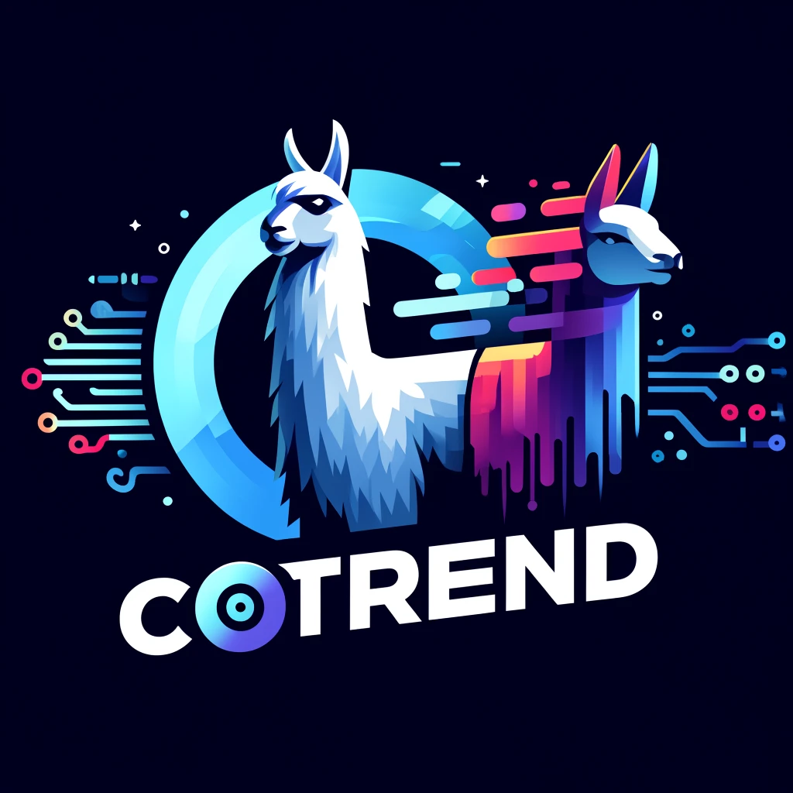

# Contrastively Trained Encodings from Decoder
Cerebral Valley Llama-3 Hackathon 2024 submission.

---

---

    

<h1 align="center" style="font-size: 2.5em; margin: 0; padding: 0;">CoTrEnD</h1>

    Extending Decoders with an Integrated Encoder

This repo holds the code for training encoders that embed the final hidden state from large decoder models. To our knowledge, CoTrEnD is the first architecture to leverage a contrastive loss to train an encoder from a decoder.

## Team:
#### Abhishek Singh  

#### Arthur Böök  

#### Wian Stipp   
