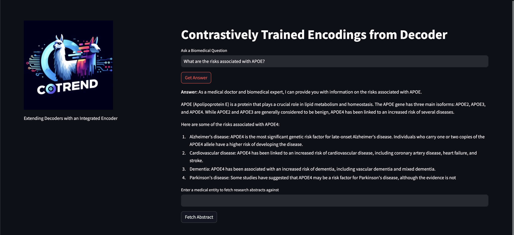
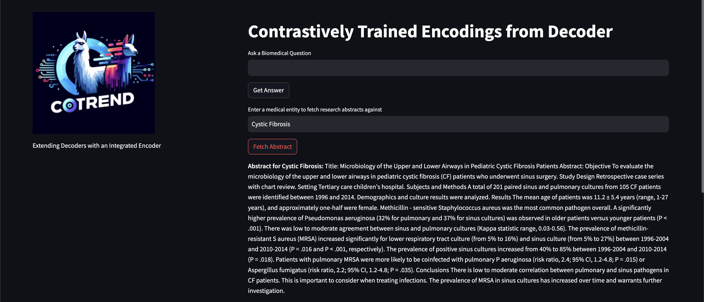

    

<h1 align="center" style="font-size: 2.5em; margin: 0; padding: 0;">Contrastively Trained Encodings from Decoder</h1>

    Extending Decoders with an Integrated Encoder

This repo holds the code for training encoders that embed the final hidden state from large decoder models. To our knowledge, CoTrEnD is the first architecture to leverage a contrastive loss to train an encoder from a decoder. It was developed as part of the 24h [Meta LLAMA-3 hackathon May 2024](https://devpost.com/software/cotrend) by [Abhishek Singh](https://github.com/abhisheksingh-7), [Arthur Böök](https://github.com/ArthurBook), and [Wian Stipp](https://github.com/WianStipp).

## Motivation
The motivation behind the CoTrEnD project is to utilize on the rich hidden states that are generated within large decoders. Rather than separating the embedder from the decoder as one typically would in a RAG approach, CoTrEnD integrates the encoder on top of the decoder. This allows the encoder to leverage the semantic information already captured within the decoder's hidden states.

## Architecture
The CoTrEnD architecture is a simple extension of the decoder-only model. The encoder is trained to embed the final hidden state of the decoder. The encoder is trained using a contrastive loss, which encourages the encoder to embed similar hidden states for similar inputs, and dissimilar hidden states for dissimilar inputs.

    

## User Interface
The CoTrEnD project includes a user interface that allows users to interact with the model. The user interface is built using Streamlit with two modes of operation.

### RAG Mode
The user can ask anything in the `question` field, and the CoTrEnD model will do a embedding search over the vectorstore to augment the generated answer.

    

### Document Lookup Mode
The user can enter a medical entity in the `entity` field, and the CoTrEnD model will return the most similar document from the vectorstore.

    

## Team
<table>
  <tr>
    <td align="center">
      <h4>Abhishek Singh</h4>
      
      
      
    </td>
    <td align="center">
      <h4>Arthur Böök</h4>
      
      
      
    </td>
    <td align="center">
      <h4>Wian Stipp</h4>
      
      
      
    </td>
  </tr>
</table>
